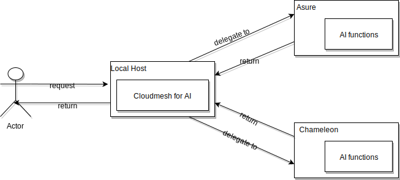

# Cloudmesh Cloud AI Service

The cloudmesh Cloud Ai service will provide AI capabilities that are running on the different cloud, e.g. chamelon, asure. For the example functions, linear regression, principle components analysis and so on will be provided so that users can utilize the computing power of the clouds to train their models. The cloudmesh cloud AI service will administrate  multiple clouds and determine which cloud to use for scheduled tasks. 

**Link to the project**:
 
 <https://github.com/cloudmesh/cloudmesh-analytics>


## Group Members

* Qiwei Liu
    * hid: 151
    * Link to the hid repo 
        * <https://github.com/cloudmesh-community/fa19-516-151>

* Yanting Wan
    * hid: 170
    * Link to the hid repo 
        * <https://github.com/cloudmesh-community/fa19-516-170>

## Architecture Design



The architecture primarily contains four objects:

* User which is the actor
* The application running on local host using cloudmesh  will manipulate multiple cloud instance, decides delegate computational tasks to which cloud
* The AI services will be running on the Asure, Chameleon, and Chameleon cloud, exposing APIs to incoming requests, and return the return the result to the local host


## Technical Analysis

### Operating System

* Mac OS

### Databae

* Mongodb

### REST

* OpenAPI: The REST API will be defined by using OpenAPI specification 
* Swagger editor: The swagger editor is used to write API documentation based on the OpenAPI standard 
* Flask: The web application framework that handles incoming requests
* Connexion: Connexion is an application on the top of Flask that will map the REST API documentation to python functions
on Flask
* Pytest will be the testing framework

## Benchmark 

## Reference 

# Development 

## Progress 

### Week 6

[Qiwei Liu](https://github.com/cloudmesh-community/fa19-516-151/graphs/contributors)

1. Set up flask web application framework
2. Set up the test framework and testing data based using sqlite3
3. Done file upload, list file
4. Set up chameleon instance

[Yanting Wan](https://github.com/cloudmesh-community/fa19-516-151/graphs/contributors)

1. Set up connexion, and uses it to map Opean API(yaml) file.
2. Done uploading file locally, testing it on Swagger-ui
3. Done testing a ai function with locally stored dictionary as parameter, testing it on Swagger-ui

### Week 7

[Qiwei Liu](https://github.com/cloudmesh-community/fa19-516-151/graphs/contributors)

1. Update folder structure
2. Gregor update folder structure, refactor file routes, refacter to analytics route
3. Change folder structure
3. Change folder structure by putting functions under cloudmesh directory
4. update project report
5. Update report.md
7. Update linear regression tests and the exception handling
8. Change cloudmesh package structure
9. Merge remote-tracking branch 'refs/remotes/origin/master'
10. Add more tests to file operations
11. Done prototyping linear regression
12. Merge remote-tracking branch 'refs/remotes/origin/master'

### Week 8 

1. Migration to cloudmesh-analytics <https://github.com/cloudmesh/cloudmesh-analytics>

[Yanting Wan](https://github.com/cloudmesh-community/fa19-516-151/graphs/contributors)

1. Download a virtual box to run Ubuntu 19.04 system.
2. Reinstall cloudmesh-cloud, mongoDB in Ubuntu 19.04.
3. Start a VM in Chameleon.
4. Create venv and install requirements in migrated project folder.

- [ ] Problem1: cannot ssh into VM

### Week 9

[Qiwei Liu](https://github.com/cloudmesh-community/fa19-516-151/graphs/contributors)

1. Add cms command to start and stop the server

### Comments on Files

## Work Breakdown

## Example Usages

1. Upload a file to the server that will be further processed

```sh
curl -X POST "http://localhost:8000/cloudmesh-ai-services/upload" -H "accept: application/json" -H "Content-Type: multipart/form-data" -F "file=@learn.rkt"
```


2. Checking the uploaded files

```sh
curl -X GET "http://localhost:8000/cloudmesh-ai-services/list-files" -H "accept: application/json"
```


3. Contracting a json file which contains the file name, and the parameters for the linear regression to the REST API. The output will be save on the server that could be downloaded.

```sh
curl -X POST "http://localhost:8000/cloudmesh-ai-services/linear-regression/linear" -H "accept: */*" -H "Content-Type: application/json" -d "{\"file_name\":\"string\",\"fit_intercept\":true,\"n_jobs\":0,\"normalize\":true}"
```


The next version will encapsulate the server request command and user can only provide the content body, For example，

```sh
cloudmesh ai upload "linear_regression.csv"
```
